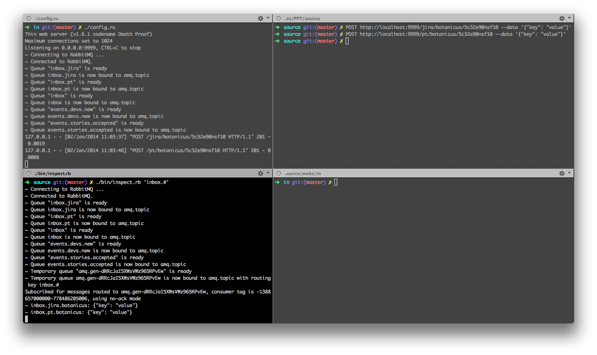

# About

* When a story on **PT** is changed, PT `POST` to `in.ppt.com/pt/user/auth_key`.
* If authentication was successful, the data are published to `inbox-exchange` fanout.
* There's queue called `inbox` which is bound to the `inbox-exchange`.

TODO: The image doesn't work, rewrite to Markdown.

<a href="how-it-works.png"></a>

# Initial Setup

```
git config alias.deploy 'push origin master:deployment'
cp -f hooks/pre-push .git/hooks/
```

1. Create `config/amqp.json` with keys `user`, `password` and `vhost`.</li>
2. Run `./bin/setup_rabbitmq.rb` to set up RabbitMQ users and permissions.</li>

# Simulation (Creating Fake Data)

```
curl -X POST http://localhost:9999/pt/botanicus/5c32e90nsf10 --data '{"key": "value"}'
curl -X POST http://localhost:9999/jira/botanicus/5c32e90nsf10 --data @consumers/inbox.jira/sample_data.json
```

# Inspection

Run `./inspect.rb 'inbox.#'`. It doesn't touch the production queue. Rather it creates a temporary queue and binds it to the fanout.
